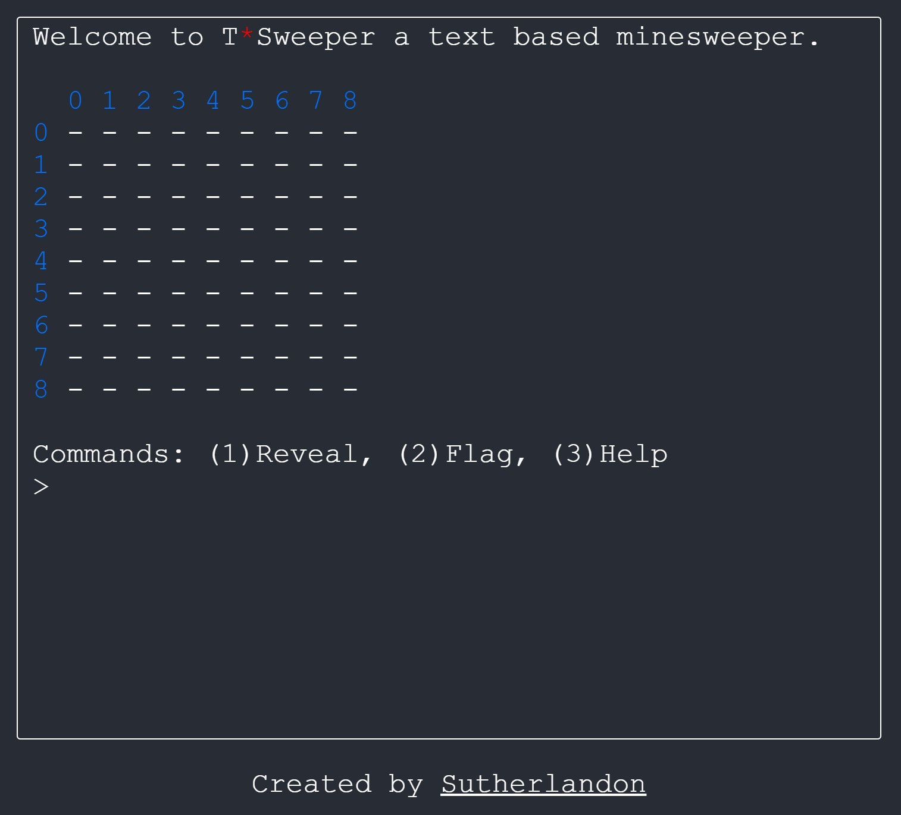

# T*Sweeper
T*Sweeper is a text based minesweeper game. I was inspired by a terminal based minesweeper game that I wrote as an assignment in high school. This game uses nothing but text for graphics and layout, and accepts typed commands, simulating a unix terminal. Built purely in React, it is also a Progressive Web App, so you can install it on your phone.

Check it out at [tsweeper.sutherlandon.com](https://tsweeper.sutherlandon.com).

